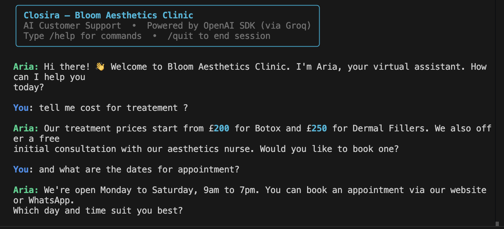

<div align="center">
  <a href="https://drive.google.com/file/d/1WImazpWiUVcaEABYs1NDLoBlV_K5v1Mq/view?usp=sharing">
    
  </a>
  
  # 🌸 Closira AI Agent — Bloom Aesthetics Clinic
  **An intelligent, SOP-grounded customer support workflow.**
  
  [](https://www.python.org/downloads/)
  [](https://groq.com/)
  [](#)
  
  <br>
  <a href="https://drive.google.com/file/d/1WImazpWiUVcaEABYs1NDLoBlV_K5v1Mq/view?usp=sharing">
    
  </a>
</div>

---

## ✨ What This Does

The **Closira AI Agent** simulates a complete customer support session for a fictional aesthetics clinic. It intelligently handles inbound enquiries across four structured stages:

- **🛡️ Strict SOP Adherence:** Answers questions **only** from a defined SOP (Zero hallucination).
- **🎯 Lead Qualification:** Qualifies leads by asking 3 structured questions naturally.
- **🚨 Smart Escalation Detection:** Detects triggers (complaints, medical questions, out-of-scope queries) and smoothly hands off to a human agent, logging the reason.
- **📝 Automated Summarisation:** Generates a structured JSON session summary at the end of every conversation.

---

## 🚀 Setup Instructions

### 1. Clone the repository
```bash
git clone https://github.com/nmnroy/Closira-AI-Agent.git
cd Closira-AI-Agent/closira-agent
```

### 2. Install dependencies
```bash
pip install -r requirements.txt
```

### 3. Configure your Environment
```bash
cp .env.example .env
```
Edit `.env` and add your **Groq API Key**:
```env
GROQ_API_KEY=your_groq_api_key_here
```
> **Get a free Groq API key here:** [console.groq.com/keys](https://console.groq.com/keys)

### 4. Run the agent
```bash
python3 main.py
```

---

## 🎮 In-Session Commands

| Command | Action |
|---------|--------|
| `/qualify` | Switch to lead qualification mode (asks 3 structured questions) |
| `/summary` | Generate and display structured session summary |
| `/quit` | End session and auto-generate summary |
| `/help` | Show available commands |

---

## 🧠 How It Works: The Four Stages

### 1️⃣ FAQ Answering (`stages/faq.py`)
Answers customer questions strictly from `sop.json`. If a question falls outside the SOP, the model embeds an escalation flag `{"escalate": true, "reason": "out_of_scope"}`. The parser strips this from the visible reply and routes the session to escalation.

### 2️⃣ Lead Qualification (`stages/qualification.py`)
Triggered by `/qualify` or when a customer expresses interest. Asks:
1. *Which service are you interested in?*
2. *Are you a first time or returning customer?*
3. *How soon are you looking to book?*

### 3️⃣ Escalation Detection (`stages/escalation.py`)
Detects escalations via AI-driven sentiment analysis or rule-based limits (e.g. 2+ unanswered questions). Triggers on: `complaint`, `medical_question`, `pricing_negotiation`, `out_of_scope`, or `explicit_request`. Escalations are beautifully logged to `logs/`.

### 4️⃣ Conversation Summary (`stages/summary.py`)
Generated on `/quit` or `/summary`. Outputs a clean JSON payload mapping out `customer_intent`, `key_details`, `sop_gaps`, and `recommended_next_action`.

---

## 📂 Project Structure

```text
closira-agent/
├── main.py                # CLI entry point and session orchestrator
├── agent.py               # AI caller (using Groq's OpenAI-compatible endpoint)
├── sop.json               # SOP data — the only source of truth
├── .env                   # Environment variables (Groq Key)
├── stages/                # The 4 workflow stages (faq, qualification, escalation, summary)
├── utils/                 # Logging utilities
├── logs/                  # Auto-generated JSON logs for summaries and escalations
├── test_transcripts/      # Test scenarios demonstrating agent behavior
└── prompt_design.md       # Comprehensive breakdown of prompt engineering & design
```

---

## ⚡ Under the Hood

- **LLM Engine:** Powered by `llama-3.3-70b-versatile` running via [Groq](https://groq.com/) for lightning-fast inference using the OpenAI SDK.
- **Stateless Design:** Session history lives in RAM for a fast, simple CLI demo.
- **Adaptability:** Swap `sop.json` to adapt the agent for *any* business instantly—no code changes required!

---

<div align="center">
Built by <b>Naman Roy</b> for the Closira AI Engineering Intern Assignment.<br>
<a href="https://github.com/nmnroy">@nmnroy</a>
</div>
